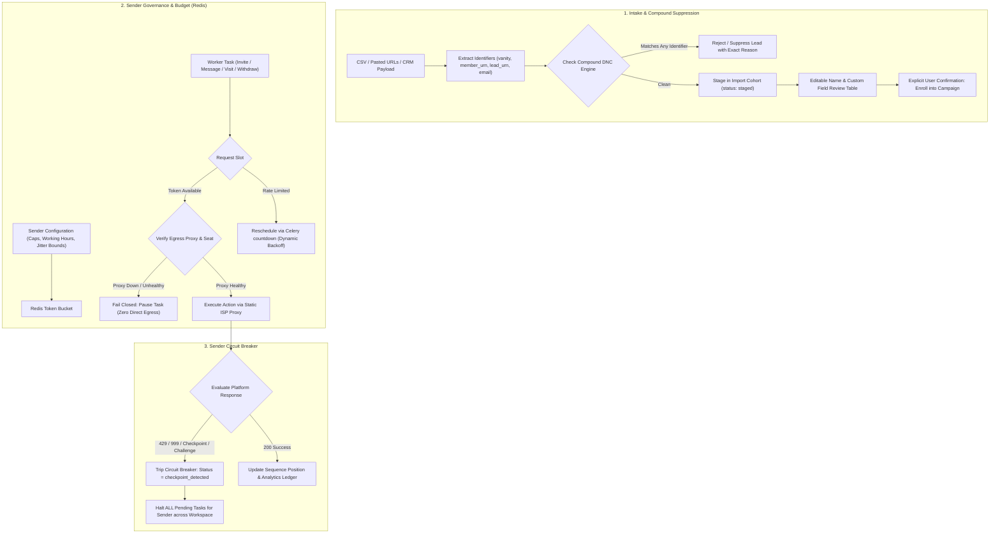

# Outreach Dripify Parity & Safety Master Plan

Date: 2026-09-30  
Status: Approved Implementation Blueprint  
Target Module: `outreach/`, `celery_workers/tasks/`, `frontend/src/outreach/`

---

## 1. Executive Summary & Strategic Approach

Following the audit of Dripify's quick-start workflow and critical peer review of LinkedIn platform safety, this plan implements full workflow parity with Dripify's high-value capabilities while eliminating systemic vulnerabilities:
1. **No Hardcoded Values**: All pacing intervals, limits, working hours, withdrawal thresholds, and retry countdowns are driven dynamically by workspace configuration, sender account parameters, or platform response headers.
2. **Path A Architecture (Disciplined Pragmatist)**: Prioritizes rock-solid outbound execution, fail-closed proxy routing, compound Do-Not-Contact (DNC) suppression, and non-destructive data cleaning. Native server-side search scraping is gated behind an explicit Phase 0 legal sign-off and outbound pilot validation.
3. **Defense in Depth**: Pacing is governed by a Redis-backed sender rate budget (token bucket) rather than arbitrary `sleep()` loops. Any platform challenge (429, 999, CAPTCHA) immediately trips a sender-scoped circuit breaker to protect customer accounts.

---

## 2. Architecture & System Flow



---

## 3. Phase Specifications

### Phase 1: Compound Identifiers & Unified DNC Suppression Engine
**Objective**: Fix the cross-source identifier mismatch bug so Sales Navigator exports, CSV lists, and pasted vanity URLs share a unified, bulletproof suppression check.

#### 1.1 Multi-Identifier Schema (`outreach/models.py`)
```python
class LeadIdentifiers(BaseModel):
    normalized_url: str | None = None      # Standardized: https://linkedin.com/in/<vanity>
    vanity_name: str | None = None         # Extracted vanity handle: 'johndoe'
    member_urn: str | None = None          # Stable LinkedIn URN: 'urn:li:member:12345678' or '12345678'
    sales_lead_urn: str | None = None      # Sales Nav identifier: 'urn:li:fs_salesProfile:(...)' or opaque ID
    email: str | None = None               # Primary contact email

class OutreachLead(BaseModel):
    # Existing core fields...
    identifiers: LeadIdentifiers
    raw_first_name: str | None = None      # Untouched input string
    cleaned_first_name: str | None = None  # Normalized preview string
```

#### 1.2 Compound Suppression Query (`outreach/core/lead_importer.py`)
No lead can bypass suppression by changing source formats:
```python
async def check_compound_suppression(
    workspace_id: str,
    candidates: list[LeadIdentifiers],
    db: AsyncIOMotorDatabase
) -> set[str]:
    """
    Evaluates candidates against both the Do-Not-Contact collection and existing 
    workspace leads using an indexed compound query across all populated keys.
    """
    candidate_urls = [c.normalized_url for c in candidates if c.normalized_url]
    candidate_vanities = [c.vanity_name for c in candidates if c.vanity_name]
    candidate_members = [c.member_urn for c in candidates if c.member_urn]
    candidate_sales = [c.sales_lead_urn for c in candidates if c.sales_lead_urn]
    candidate_emails = [c.email for c in candidates if c.email]

    clauses = []
    if candidate_urls:
        clauses.append({"identifiers.normalized_url": {"$in": candidate_urls}})
    if candidate_vanities:
        clauses.append({"identifiers.vanity_name": {"$in": candidate_vanities}})
    if candidate_members:
        clauses.append({"identifiers.member_urn": {"$in": candidate_members}})
    if candidate_sales:
        clauses.append({"identifiers.sales_lead_urn": {"$in": candidate_sales}})
    if candidate_emails:
        clauses.append({"identifiers.email": {"$in": candidate_emails}})

    if not clauses:
        return set()

    query = {"workspace_id": workspace_id, "$or": clauses}
    suppressed_docs = await db.outreach_dnc.find(query, {"identifiers": 1}).to_list(None)
    # Extracts matching keys and returns matching candidate indices
```

#### 1.3 Database Indexes
Create sparse compound indexes on MongoDB collections (`outreach_leads`, `outreach_dnc`):
- `[("workspace_id", 1), ("identifiers.normalized_url", 1)]`
- `[("workspace_id", 1), ("identifiers.vanity_name", 1)]`
- `[("workspace_id", 1), ("identifiers.member_urn", 1)]`
- `[("workspace_id", 1), ("identifiers.sales_lead_urn", 1)]`
- `[("workspace_id", 1), ("identifiers.email", 1)]`

---

### Phase 2: Dynamic Redis Rate Budget & Sender Circuit Breaker
**Objective**: Eliminate uncoordinated actions and hardcoded `sleep()` calls. Centralize all pacing through a Redis token bucket and implement an automated circuit breaker.

#### 2.1 Dynamic Redis Rate Budget (`outreach/core/rate_budget.py`)
* Driven entirely by sender account configuration (zero magic numbers):
  - `sender.daily_action_cap` (e.g. 50/day)
  - `sender.hourly_action_cap` (e.g. 8/hour)
  - `sender.working_hours_start` & `sender.working_hours_end` (with sender timezone)
  - `sender.min_interval_seconds` & `sender.max_interval_seconds`
* **Worker Pacing Contract**:
  - Worker calls `RateBudget.acquire_token(sender_id, action_type)`.
  - If approved: returns `(True, 0)` $\rightarrow$ worker executes immediately.
  - If rate-limited or outside working hours: returns `(False, retry_after_seconds)` $\rightarrow$ Celery worker calls `self.retry(countdown=retry_after_seconds)`. No blocking `time.sleep()`.

#### 2.2 Sender-Scoped Circuit Breaker (`outreach/core/circuit_breaker.py`)
* Machine-readable `StopReason` enumeration:
  - `RATE_LIMITED_429`: LinkedIn rate limit reached.
  - `SECURITY_CHALLENGE_999`: Anomaly defense triggered.
  - `CHECKPOINT_CAPTCHA`: Security checkpoint / puzzle challenge.
  - `PROXY_UNHEALTHY`: Dedicated ISP proxy connection failed.
  - `SESSION_EXPIRED`: Session cookies invalid, manual reconnect required.
* **Trip Logic**:
  - When an outbound task catches an error matching any of the above:
    1. Update sender document: `status = "checkpoint_detected"`, `stop_reason = StopReason.<REASON>`, `stopped_at = utcnow()`.
    2. Atomically pause all pending queued sequence tasks for that `sender_id`.
    3. Trigger high-priority audit event and UI warning banner.
    4. Resume requires a mandatory cooldown window plus an explicit operator click on `POST /api/v1/outreach/accounts/{id}/resume`.

#### 2.3 Strict Fail-Closed Proxy Routing
* Before dispatching any network call to LinkedIn:
  - Retrieve assigned static ISP proxy configuration from the encrypted vault.
  - Test proxy egress health against external check.
  - If proxy is unresponsive or IP mismatches assigned lease: **fail closed immediately** (set `stop_reason = PROXY_UNHEALTHY`). Zero requests are permitted via direct server egress.

---

### Phase 3: Staged Intake & Safe Name Normalization Preview
**Objective**: Clean prospect names without destructive title-casing and present an editable preview before campaign enrollment.

#### 3.1 Non-Destructive Name Cleaning Engine (`outreach/core/name_cleaner.py`)
* **Rule 1: Uppercase Normalization**: Only apply title-casing if the string is completely capitalized:
  - `"JOHN SMITH"` $\rightarrow$ `"John Smith"`
  - `"MICHAEL O'CONNOR"` $\rightarrow$ `"Michael O'Connor"`
* **Rule 2: Preserve Mixed Case**:
  - `"McDonald"`, `"de la Cruz"`, `"van Buren"`, `"MacDonald"` $\rightarrow$ **Preserved exactly as-is**.
* **Rule 3: Noise & Badge Removal**:
  - Strip emojis (`🚀`, `🔥`, `✨`, `💼`) and trailing professional certifications (`", CPA"`, `", MBA"`, `", PhD"`, `"| Founder"`).
* **Rule 4: Dual Storage**:
  - Store both `raw_first_name` and `cleaned_first_name` so edits can always be reverted.

#### 3.2 Staged Intake UI (`ImportLeadsModal.js`)
* Multi-step workflow:
  1. **Source Selection**: CSV File or Pasted URLs.
  2. **File / Text Intake**: Column mapping and fallback configuration.
  3. **Staged Review Table**:
     - Shows all parsed contacts with live editable inputs: `Original Name` $\leftrightarrow$ `Cleaned Name Input`.
     - Displays badge flags for Duplicates, DNC suppressed rows, and invalid URLs with rejection explanations.
     - Single-click action: "Revert to Original".
  4. **Explicit Enrollment**: Operator clicks *"Confirm & Enroll {N} Valid Leads"*, converting records from `status: staged` to `status: queued`.

---

### Phase 4: Sequence Canvas Lead Counters
**Goal**: Display real-time lead counts at each sequence step in the visual builder using indexed aggregation instead of slow full-collection scans.

#### 4.1 Backend Aggregation Endpoint (`outreach/api/campaigns.py`)
* `GET /api/v1/outreach/campaigns/{id}/node-counts`
* Uses an optimized MongoDB aggregation pipeline utilizing index `[("campaign_id", 1), ("current_node_id", 1)]`:
  ```python
  pipeline = [
      {"$match": {"campaign_id": campaign_id, "execution_state": "in_progress"}},
      {"$group": {"_id": "$current_node_id", "count": {"$sum": 1}}}
  ]
  ```
* Returns: `{"node_counts": {"node-invite": 34, "node-msg-1": 15, "node-msg-2": 4}}`.

#### 4.2 SequenceCanvas UI Component (`SequenceCanvas.js`)
* Renders real-time badge on each sequence card showing:
  - `{count} leads waiting` with status-aware color coding.
  - Updates on canvas mount and when campaign status changes.

---

### Phase 5: Opt-In Pending Invite Hygiene Worker
**Goal**: Prevent customer LinkedIn accounts from hitting LinkedIn's pending invitation threshold, executed strictly within the sender's shared rate budget.

#### 5.1 Configurable Settings (No Magic Numbers)
* `auto_withdraw_enabled`: boolean (Default: **false**)
* `withdraw_after_days`: integer (Configurable per workspace, default: 21 days)
* `max_daily_withdrawals`: integer (Configurable per sender, default: 25/day)

#### 5.2 Celery Beat Task (`celery_workers/tasks/outreach.py`)
* Runs daily during configured off-peak hours.
* Execution flow:
  1. Validates `auto_withdraw_enabled == True` for the sender.
  2. Requests slot from `RateBudget.acquire_token(sender_id, "withdraw")`.
  3. Queries pending connection requests older than `withdraw_after_days`.
  4. Dispatches withdrawals up to `max_daily_withdrawals`.
  5. Records withdrawn `member_urn` in `outreach_withdrawn_invites` with timestamp to enforce a 21-day re-invitation block (LinkedIn compliance rule).

---

## 4. Testing & Verification Matrix

| Area | Test Suite | Target Invariant |
|---|---|---|
| **Phase 1: Compound Suppression** | `tests/test_outreach_compound_dnc.py` | Sales Nav URN in DNC list must suppress subsequent CSV import with matching vanity. |
| **Phase 2: Redis Budget & Pacing** | `tests/test_outreach_rate_budget.py` | Rapid task requests must return dynamic countdowns rather than blocking; zero sleep calls. |
| **Phase 2: Circuit Breaker** | `tests/test_outreach_circuit_breaker.py` | Simulated 429 must immediately transition sender to `checkpoint_detected` and halt queue. |
| **Phase 2: Fail-Closed Proxy** | `tests/test_outreach_proxy_safety.py` | Unhealthy proxy check must halt execution without leaking server IP. |
| **Phase 3: Name Cleaner** | `tests/test_outreach_name_cleaner.py` | Preserves `McDonald`, `de la Cruz`, `O'Connor`; normalizes `JOHN DOE`; strips emojis/certifications. |
| **Phase 4: Sequence Counters** | `tests/test_outreach_node_counts.py` | Node counts match exact lead distribution across 100+ simulated leads. |
| **Phase 5: Auto-Withdraw** | `tests/test_outreach_auto_withdraw.py` | Invites older than threshold are withdrawn up to daily cap; stores re-invite block record. |

---

## 5. Prerequisite Conditions for Future Native Search Crawling

Native server-side LinkedIn Search & Sales Navigator crawling remains disabled until all of the following conditions are met:
1. **Outbound Live Pilot Validated**: At least 5 live senders have successfully executed sequence steps through dedicated IPRoyal static residential proxies without checkpoints.
2. **Entity Separation Verified**: Outreach scraping operations are structurally and infrastructurally isolated from the entity applying for official LinkedIn Marketing / Community Management API permissions.
3. **Deterministic Identifier Mapping**: Verification on live payloads that search results yield canonical member identifiers to prevent DNC suppression leaks.
4. **Written Legal Go/No-Go**: Explicit executive and legal sign-off on server-side scraping liabilities.
